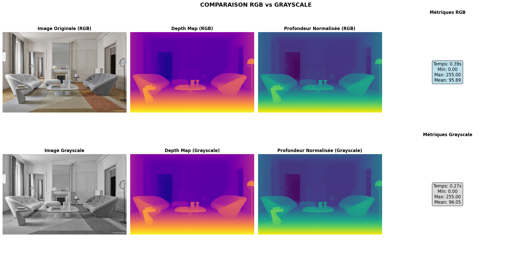
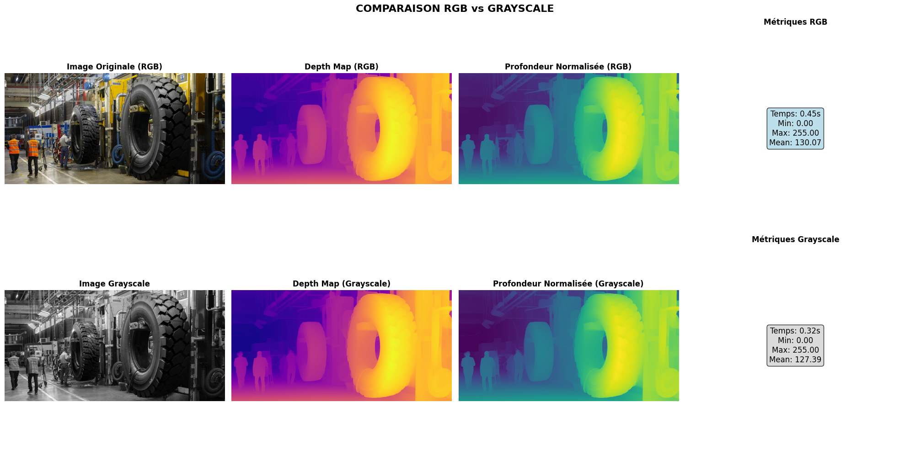

# Depth Estimation 

> Exploration d'une première approche pour l'estimation de profondeur monoculaire sur images en niveaux de gris  


[](https://www.python.org/)
[](https://pytorch.org/)
[](https://colab.research.google.com)

---

## Objectif

Évaluer la pertinence de **DepthAnything V2** pour l'estimation de profondeur sur images. Les principaux réseaux de neuronnes étant entrainés sur des images en couleur (**RBG**) tester les performances pour les images en niveau de gris (**grayscale**). 


---

## Résultats

<p align="center">
  
  
</p>

Voir le notebook complet dans `demo.ipynb` pour reproduire les résultats.

### Observations Clés

 **Ce qui fonctionne bien :**
- Estimation cohérente sur images RGB et grayscale
- Temps de traitement acceptable (~0.4s sur GPU T4)
- Segmentation claire premier plan / arrière-plan
- Duplication du canal semble effective : différence négligeable entre RGB et grayscale
- Grayscale légèrement plus rapide (~20% de gain)


 **Limitations identifiées :**
- Profondeur **relative** uniquement (pas de distances métriques)
- Tests limités à seulement 2 images (manque de temps)

 **Pistes d'amélioration :**
- Calibration métrique avec profilomètre comme ground truth pour obtenir la profondeur **absolue**
- Fine-tuning sur images spécifiques
- Tests de robustesse (éclairage, angles, surfaces)
- Optimisation pour déploiement temps réel 


---


## Technologies Utilisées

- **DepthAnything V2 Base** : Modèle state-of-the-art pour estimation de profondeur
- **PyTorch 2.0+** : Framework deep learning
- **Transformers (HuggingFace)** : Pipeline simplifié pour l'inférence
- **Google Colab** : Environnement de développement avec GPU gratuit

---

## Contexte Technique

Les caméras linéaires industrielles capturent en **niveaux de gris** pour :
- Vitesse d'acquisition supérieure
- Simplicité du traitement
- Réduction des données/coûts

Le défi est donc d'adapter les modèles d'IA (entraînés sur RGB) pour fonctionner sur ces images grayscale.

### Approche Utilisée ici 

**Conversion grayscale → RGB en dupliquant le canal 3 fois :**
```python
gray_image = image.convert('L')  # Conversion en grayscale
gray_np = np.array(gray_image)
rgb_np = np.stack([gray_np, gray_np, gray_np], axis=-1)  # Duplication du canal
```

Cette méthode simple permet de conserver la compatibilité avec les modèles pré-entraînés RGB.


## Ressources

- **DepthAnything V2 Paper** : [Depth Anything V2](https://arxiv.org/abs/2406.09414)
- **GitHub officiel** : [DepthAnything/Depth-Anything-V2](https://github.com/DepthAnything/Depth-Anything-V2)
- **HuggingFace** : [depth-anything/Depth-Anything-V2-Base-hf](https://huggingface.co/depth-anything/Depth-Anything-V2-Base-hf)
- **Documentation PyTorch** : [pytorch.org](https://pytorch.org/docs/stable/index.html)

---

## Structure du Projet

```
depth-estimation-test/
├── README.md                    # Ce fichier
├── demo.ipynb                   # Notebook Colab complet
├── requirements.txt             # Dépendances
└── images
```

---

## Contribution

Ce projet est une exploration personnelle dans le cadre d'une candidature de stage. Les suggestions et retours sont les bienvenus !

---

## Contact

**[Riyad Khichane]**  
Email : [riyad.khichane@gmail.com]  

---

## License

Ce projet est à usage éducatif et de démonstration. Le modèle DepthAnything V2 est sous licence Apache 2.0.

---

<p align="center">
  <i>Développé avec passion pour l'innovation en vision industrielle </i>
</p>

